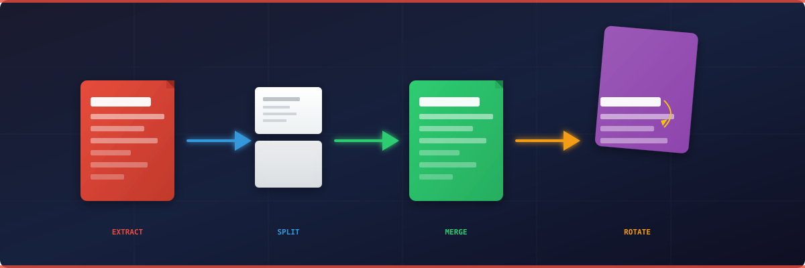

# pdfpage

[](https://python.org)
[](LICENSE)
[](https://pypi.org/project/pdfpage/)
[](tests/)

**PDF page extraction, splitting, merging, and rotation CLI tool.** Pipe-friendly, scriptable, no GUI required.

---

<p align="center">
  <a href="https://github.com/izag8216/pdfpage">
    
  </a>
</p>

<div align="center">

**[English](README.md) | [日本語](README.ja.md)**

</div>

---

## Features

| Feature | Description |
|---------|-------------|
| **Extract** | Pull specific pages from a PDF using page numbers or ranges |
| **Split** | Divide a PDF into multiple parts by page ranges |
| **Merge** | Combine multiple PDF files into one |
| **Rotate** | Rotate specific pages (90, 180, 270 degrees) |
| **Info** | Display PDF metadata and page count |
| **Pipe-friendly** | Works with shell pipes and scripts |

## Commands

| Command | Description |
|---------|-------------|
| `extract` | Extract pages to new PDF |
| `split` | Split PDF into multiple files |
| `merge` | Merge multiple PDFs into one |
| `rotate` | Rotate pages in PDF |
| `info` | Show PDF information |

## Page Specification

Pages are specified as 1-indexed numbers or ranges:

| Format | Example | Description |
|--------|---------|-------------|
| Single | `1` | Page 1 |
| Multiple | `1,3,5` | Pages 1, 3, and 5 |
| Range | `1-10` | Pages 1 through 10 |
| Mixed | `1,3,5-10` | Pages 1, 3, and 5 through 10 |

## Examples

### Extract first 5 pages

```bash
pdfpage extract input.pdf --pages 1-5 --output output.pdf
```

### Extract non-contiguous pages

```bash
pdfpage extract input.pdf --pages 1,3,7,10-15 --output output.pdf
```

### Split into 3 equal parts

```bash
pdfpage split big.pdf --ranges 1-33 34-66 67-99 --output-dir ./split
```

### Merge in order

```bash
pdfpage merge chapter1.pdf chapter2.pdf chapter3.pdf --output book.pdf
```

### Rotate scanned pages

```bash
pdfpage rotate scan.pdf --degrees 90 --pages 2,4,6 --output corrected.pdf
```

## Python API

```python
from pdfpage import extract_pages, merge_pdfs, rotate_pages

# Extract pages
result = extract_pages("input.pdf", "output.pdf", [0, 2, 4])

# Merge PDFs
result = merge_pdfs(["a.pdf", "b.pdf"], "merged.pdf")

# Rotate pages
result = rotate_pages("input.pdf", "output.pdf", 90, [1, 3])
```

## License

MIT License — see [LICENSE](LICENSE) for details.

## Contributing

Contributions welcome! See [CONTRIBUTING.md](CONTRIBUTING.md) for setup instructions.

---

*pdfpage — PDF manipulation made simple.*